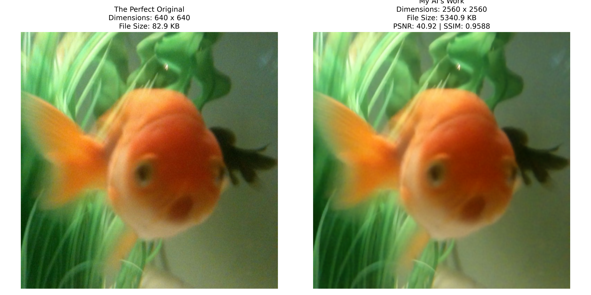

# Image Super-Resolution and Denoising Pipeline

## Why I Built This Project
I started this project because of a very frustrating personal problem. A while ago, I lost a large amount of old, important photos from my phone because they were accidentally deleted. I spent days trying to get them back and finally I finally managed to recover them using a data recovery application called DroidKit. The app worked, and it pulled my files back from the phone's memory, but there was a massive catch. The recovered files were in terrible physical condition. 

Most of the photos I got back were tiny. They were severely compressed, sitting at around 20 KB to 25 KB in size. Because the file sizes were so small, the quality was completely ruined. Whenever I tried to open a picture and zoom in on a face, a pet, or a background object, the picture just turned into a messy grid of blurry, colored squares. 

I tried to use standard photo editing apps on my computer to make the pictures bigger but I quickly learned that basic upscaling tools do not actually fix anything. Standard image editors use simple math to stretch an image. If you take a blurry 23 KB photo and stretch it, you just get a larger blurry photo. Standard tools cannot replace details that were deleted by the recovery software. 

I decided I needed a custom, highly technical solution. so I had to build a deep learning AI program from scratch. My goal was to create a program that could look at a heavily compressed, blurry image, understand what was missing, and actually draw the lost details back into the photo to restore it natively on my own laptop.

## The Final Output and Test Image Analysis
I ran many tests on my code while building this pipeline, but I want to share the exact details of one specific test image. This specific test proves exactly how much physical work the AI is doing in the background to restore a photo. You can see the visual proof of this in the image at the top of this page.

I started with a test image that was very low quality. The original resolution of this bad image was only 640 by 640 pixels. The file size was extremely small, sitting at just 83 KB. It was blurry, it had no clear edges, and the colors bled together heavily.

I ran this 83 KB test image through my final trained AI model. The AI scaled the image up by four times its original size. The final picture came out at a massive 2560 by 2560 pixels. But the most important part of this test is the file size. The file size jumped from 83 KB all the way up to 5341 KB (which is over 5 Megabytes). 

This massive jump in file size did not happen just because the picture got wider. It happened because the AI literally created and filled in thousands of missing pixels of raw data. It cleared up the static noise, it figured out where the edges of objects were supposed to be, and it drew sharp lines over the blurry spots. 

You can look in the `output` folder of this project repository to see these exact files. The original bad file is named `test.png` and the fixed, heavy file is named `enhanced_test.png`. 

## The Dataset
An AI is exactly like a student in school. It needs to study perfect images so it knows what a good, clean picture is supposed to look like before it can fix a bad one. To teach my AI, I used a famous collection of images called the DIV2K dataset. People who research image restoration and computer vision use this specific dataset all the time because the pictures are incredibly high quality, meaning they have zero compression artifacts. 

I did not download this dataset from Kaggle because I noticed that community links on Kaggle go dead, get broken, or get deleted by users way too often. I wanted a permanent solution for my project. So, I went straight to the academic source and downloaded the data directly from the official ETH Zurich university website.

**Download Source:**
https://data.vision.ee.ethz.ch/cvl/DIV2K/

**Which Files I Used:**
If you go to that website, you will see a lot of different download links for different types of blur and resolution. You only need to download two specific zip files from the section labeled "High Resolution Images". My Python code handles all the shrinking, blurring, and resizing automatically in the background, so you only need to download the big, perfect files.

1. `Train Data (HR images)`: This zip file contains 800 high-resolution images. I use these to teach the AI during the 100 loops of training.
2. `Validation Data (HR images)`: This zip file contains 100 high-resolution images. I use these to test the AI and grade its homework to see if it actually learned anything.

**How to Set Up the Folders:**
After you download the two zip files, you need to extract them into the correct folders inside this project workspace. If you do not set this folder structure up perfectly, the Python code will not know where to find the pictures and the program will crash immediately. 

Create a folder named `datasets`. Inside that new folder, create another folder named `div2k`. Put the extracted images into that folder. Your project must look exactly like this:

* datasets/
  * div2k/
    * DIV2K_train_HR/ (Put the 800 training images here)
    * DIV2K_valid_HR/ (Put the 100 validation images here)

## My Development Process and Iterations
Building this pipeline was a very long and difficult process, It wasn't easy, and I made a lot of mistakes. I went through four major versions of the codebase before it finally worked the way I wanted it to. Here is the step-by-step path I took, the failures I ran into, and the exact engineering changes I made to fix them.

### Iteration 1: The Blurry Math Problem
When I first started writing the AI architecture, I used a very basic learning formula called L1 Pixel Loss. This formula is simple but lazy. It tells the AI to look at a blurry spot on the bad image, look at the perfect original image, and guess the safest math average for that pixel's color. 

The AI got really high math test scores using this method. But when I actually looked at the pictures it generated, they were terrible. The images were completely smooth and blurry. I realized the AI was too scared to draw sharp lines. If the AI guessed a sharp line and put it one pixel too far to the left, the math formula would punish it heavily. So, to keep its math score high and avoid punishment, it just blended all the colors together into a blur. I knew I had to change my approach completely to get sharp textures.

### Iteration 2: Simulating Real Damage
I also realized the AI was failing because it was only learning how to fix simple shrinking. In my first test, I just made the images smaller and asked the AI to make them bigger. But my recovered phone photos had real, complex damage. They had sensor grain from bad lighting and blocky compression from the DroidKit recovery app. 

To fix this blind spot, I completely rewrote my `data_prep.py` script,  took the 800 perfect DIV2K images and wrote code to ruin them on purpose, added artificial camera shake,  added random static noise. I even simulated bad JPEG compression to make them look blocky and ugly. This forced the AI to learn how to deal with messy, chaotic pictures instead of clean ones.

### Iteration 3: The GAN Upgrade
To fix the blurry images from my first iteration, I changed the entire brain of the AI. I stopped using simple math averages and turned the project into a Generative Adversarial Network, also known as a GAN. 

This means I built two completely separate AIs that fight each other in the code. The first AI is the Artist. Its job is to fix the picture and draw sharp details. The second AI is the Critic. Its job is to look at the Artist's work and catch any fake details. I also added a pre-trained VGG model. The VGG model acts like a pair of human eyes to check if the textures look natural. Because the Artist was now trying to trick the Critic, it stopped making safe, blurry pictures. It actually started hallucinating and drawing sharp textures like hair, leaves, and clear lines to make the Critic think the photo was real.

### Iteration 4: Overcoming Hardware Limits
I built all of this code on my personal laptop, which is an MSI Prestige 14. It has an NVIDIA GeForce RTX 4050 graphics card. This is a very good graphics card for gaming, but it only has 6 Gigabytes of VRAM (Video RAM). 

When I tried to run my new GAN model, my laptop crashed instantly. 6GB of VRAM is just not enough memory to load big 2K resolution images into an AI brain all at once. It caused an Out of Memory error. I had to make major changes to the training code so my laptop would not overheat and crash. 

First, I wrote a custom dataset tool that randomly cuts the large images into tiny 64 by 64 pixel squares during training. Second, added a PyTorch tool called GradScaler. Normally, computers do math using 32-bit numbers. GradScaler forces the graphics card to use 16-bit math, which literally cuts the memory usage in half without losing quality. After I made these two massive changes, my laptop successfully trained the AI for 100 full rounds without crashing a single time.

## Project Files Explained in Depth
Here is a highly detailed list of every single Python file I wrote for this project, and exactly what it does in the background.

* `requirements.txt`: This is a simple text file that holds the names of all the libraries my project needs to run. 
* `check_env.py`: I use this script to make sure my laptop is set up correctly before I do anything else. It checks if all my libraries are installed. Most importantly, it checks if my NVIDIA graphics card is being used by the code. Deep learning math takes forever on a regular processor. If this script says it is using the CPU, I know something is wrong and the training will take days instead of hours.
* `data_prep.py`: This is the script that takes the 800 perfect images and ruins them. It applies the camera blur, the static noise, and the bad JPEG compression. It also creates a brand new folder full of these bad images so the AI has realistic practice material to study.
* `model.py`: This is the file where all the complex deep learning math lives. It contains the code for the Artist network (LightweightSRNet), the Critic network (CriticNet), and the Texture checker (FeatureLoss). I do not run this file directly. It just acts as the structural blueprint for the other files to pull from.
* `train.py`: This is the main training gym. It is the heaviest script in the project. It takes the good images and the bad images and feeds them to the AI over and over again. It runs for 100 loops (epochs). During each loop, it calculates how wrong the AI is, updates the brain weights using the GradScaler, and slowly makes it smarter over a few hours.
* `inference.py`: This is the tool I use to actually fix my old photos. I give it a single bad image, and it uses the fully trained AI brain weights to scale the image up by four times, clean the noise out, and save the final result.
* `evaluate.py`: This script grades the AI's homework. It compares a fixed image to a perfect original image. It calculates the final math scores (PSNR and SSIM) to see how well the AI performed. It also checks the file sizes and dimensions, and saves a visual chart showing the results side by side.

## How to Run the Code
If you want to run this project on your own computer, you need to follow these steps exactly in this order. If you skip a step, the program will crash.

**Step 1:** Install the required libraries. Open your command prompt or terminal in the main project folder and run this exact command:
`pip install -r requirements.txt`

**Step 2:** Download the DIV2K dataset from the official academic link I provided above. Extract the files and put them into the `datasets/div2k/` folder exactly how I explained in the dataset folder setup section.

**Step 3:** Check your computer hardware. Run this command:
`python check_env.py`
Make sure the terminal prints out that your GPU is detected. If you only have a CPU, the next training step will take several days to finish.

**Step 4:** Run this command to prepare the data:
`python data_prep.py`
This will take a few minutes. You will see a progress bar in the terminal as it corrupts all 800 images to make the practice data.

**Step 5:** Run this command to teach the AI:
`python train.py`
This will take several hours depending on how fast your computer is. You will hear your computer fans turn on because the graphics card is doing a massive amount of heavy math. Do not close the window. When it is completely finished, it will automatically save a file called `best.pt` in a new folder called `weights`.

**Step 6:** Find a blurry, wrecked photo you want to fix. Put it in the main project folder. Rename the picture to `test.png`.

**Step 7:** Run this command to fix the picture:
`python inference.py`
The AI will process the image. It will create a new folder called `output` and save the clean, large picture in there as `enhanced_test.png`. e.g [Final Output](output/enhanced_test.png)

**Step 8:** If you want to see the math scores and the final side-by-side chart, run this final command:
`python evaluate.py`
It will compare the pictures, calculate the file sizes, and draw a graph for you in the output folder.

## System Specs
* Machine: MSI Prestige 14
* Graphics Card: NVIDIA GeForce RTX 4050
* VRAM Constraint: 6GB
* Language: Python 3
* Main Deep Learning Library: PyTorch

